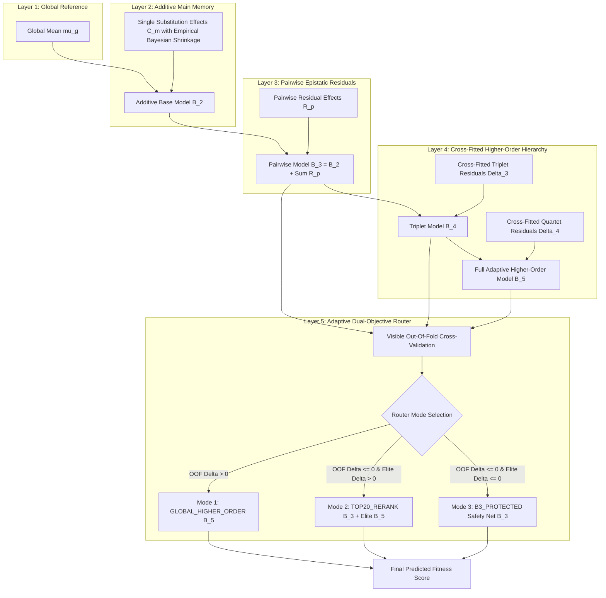

# Mathematical Architecture and Algorithmic Foundations (NABU V8.3)

## 1. Problem Formulation

Let a protein variant $x$ be defined as a set of $K$ discrete amino-acid substitutions relative to a wild-type reference sequence:
$$x = \{m_1, m_2, \dots, m_K\}$$
where each element $m_k = (\text{wt\_aa}, \text{pos}_k, \text{mut\_aa})$ denotes a single-point substitution at residue position $\text{pos}_k$.

Given a training set of observed combinatorial variants $\mathcal{D}_{\text{visible}} = \{(x_i, y_i)\}_{i=1}^N$, where $y_i \in \mathbb{R}$ represents experimental fitness measured via Deep Mutational Scanning (DMS), the objective is to predict the fitness $\hat{y}(x)$ of unseen combinatorial variants $x \in \mathcal{X}_{\text{hidden}}$.

---

## 2. Layered Architectural Decomposition

---

### 2.1 Layer 1: Global Baseline
The visible sample mean $\mu_g$ is computed directly from training observations:
$$\mu_g = \frac{1}{|\mathcal{D}_{\text{visible}}|} \sum_{(x_i, y_i) \in \mathcal{D}_{\text{visible}}} y_i$$

---

### 2.2 Layer 2: Main Memory with Empirical Bayesian Shrinkage
For each single substitution $m$, let $\mathcal{S}_m = \{(x_i, y_i) \in \mathcal{D}_{\text{visible}} \mid m \in x_i\}$ denote the subset containing $m$, with support $n_m = |\mathcal{S}_m|$.

The raw observed mean for substitution $m$ is:
$$\bar{y}_m = \frac{1}{n_m} \sum_{(x_i, y_i) \in \mathcal{S}_m} y_i$$

Under an Empirical Bayes prior centered at the global mean, the shrinkage-adjusted component effect $C(m)$ is:
$$C(m) = (\bar{y}_m - \mu_g) \cdot \left( \frac{n_m}{n_m + \lambda_{\text{main}}} \right)$$
where $\lambda_{\text{main}} > 0$ serves as the regularization parameter (default $\lambda_{\text{main}} = 1.0$).

The additive base score for any combination $x$ is:
$$\text{Base}(x) = \mu_g + \sum_{m \in x} C(m)$$

---

### 2.3 Layer 3: Pairwise Epistatic Residuals
Linear additive models fail to capture second-order residue-residue interactions. First-order additive residuals are computed for all visible variants:
$$r_i = y_i - \text{Base}(x_i)$$

For each residue pair $p = (m_j, m_k) \in \binom{x}{2}$, let $\mathcal{S}_p = \{(x_i, y_i) \in \mathcal{D}_{\text{visible}} \mid \{m_j, m_k\} \subseteq x_i\}$ with support $n_p = |\mathcal{S}_p|$.

The mean residual interaction is:
$$\bar{r}_p = \frac{1}{n_p} \sum_{i \in \mathcal{S}_p} r_i$$

Applying pairwise Empirical Bayesian shrinkage yields the regularized pairwise effect:
$$R(p) = \bar{r}_p \cdot \left( \frac{n_p}{n_p + \lambda_{\text{pair}}} \right)$$

The pairwise predicted score ($B_3$) is:
$$\hat{y}_{B_3}(x) = \text{Base}(x) + \sum_{p \in \binom{x}{2}, \, p \in \mathcal{P}_{\text{obs}}} R(p)$$

---

### 2.4 Layer 4: Cross-Fitted Triplet and Quartet Higher-Order Hierarchy
To capture 3-body and 4-body epistasis without in-sample overfitting, NABU implements $K$-fold cross-fitting (default $K=5$, seed 161). 

Second-order residuals are defined as:
$$r_{2, i} = y_i - \hat{y}_{B_3}(x_i)$$

For each triplet $t = (m_j, m_k, m_l) \in \binom{x}{3}$ and quartet $q = (m_j, m_k, m_l, m_m) \in \binom{x}{4}$, out-of-fold cross-fitted memory tables are constructed:
$$\Delta_3(t) = \bar{r}_{2, t} \cdot \left( \frac{n_t}{n_t + \lambda_{\text{triplet}}} \right), \quad \Delta_4(q) = \bar{r}_{3, q} \cdot \left( \frac{n_q}{n_q + \lambda_{\text{quartet}}} \right)$$

The full adaptive higher-order score ($B_5$) combines all hierarchical orders:
$$\hat{y}_{B_5}(x) = \hat{y}_{B_3}(x) + \sum_{t \in \binom{x}{3}} \Delta_3(t) + \sum_{q \in \binom{x}{4}} \Delta_4(q)$$

---

### 2.5 Layer 5: Adaptive Dual-Objective Router
To prevent whole-landscape rank harm on sparse or noisy combinatorial datasets while retaining maximum elite candidate discovery power, NABU performs automated visible out-of-fold (OOF) cross-validation:

$$\Delta_{\text{OOF}} = \rho_{\text{OOF}}(B_4) - \rho_{\text{OOF}}(B_3)$$

1. **Mode 1 (`GLOBAL_HIGHER_ORDER`)**: If $\Delta_{\text{OOF}} > 0$, the full higher-order model ($B_5$) is applied across the entire landscape.
2. **Mode 2 (`RANK_PRESERVING_B3_TOP20_B5_RERANK`)**: If $\Delta_{\text{OOF}} \le 0$ but visible OOF Top-20% elite diagnostic shows positive top-percentile gain ($\Delta_{\text{Top50}} > 0$) without decreasing Top-1% hits, the bottom 80% retains $B_3$ ranking while the top 20% elite pool is reranked by $B_5$.
3. **Mode 3 (`B3_PROTECTED_NO_HIGHER_ORDER`)**: If neither global nor elite higher-order gains are observed, higher-order terms are suppressed and $B_3$ is preserved exactly as a safety net.

---

## 3. Computational and Asymptotic Complexity

| Dimension | Deep Learning Models (ESM-2 / AlphaFold / ProteinMPNN) | NABU V8.3 Architecture | Practical Advantage |
| :--- | :---: | :---: | :---: |
| **Model Nature** | Parametric Neural Network ($10^8 - 10^9$ weights) | **Non-Parametric Epistatic Memory Hierarchy** | Zero weight tuning / exact hash lookup |
| **Compute Hardware** | High-end GPU Clusters (A100 / H100) | **Standard x86 / ARM CPU** | $> 10^4\times$ lower hardware cost |
| **Fitting Latency** | Hours to Days | **$< 0.5$ seconds** | $> 50,000\times$ faster iteration |
| **Inference Throughput** | $10 - 100\text{ variants/sec}$ | **$> 100,000\text{ variants/sec}$** | Instantaneous library evaluation |
| **Memory Footprint** | Gigabytes of VRAM | **Megabytes of RAM** | $O(N + |\mathcal{P}| + |\mathcal{T}| + |\mathcal{Q}|)$ linear in observed tuples |
