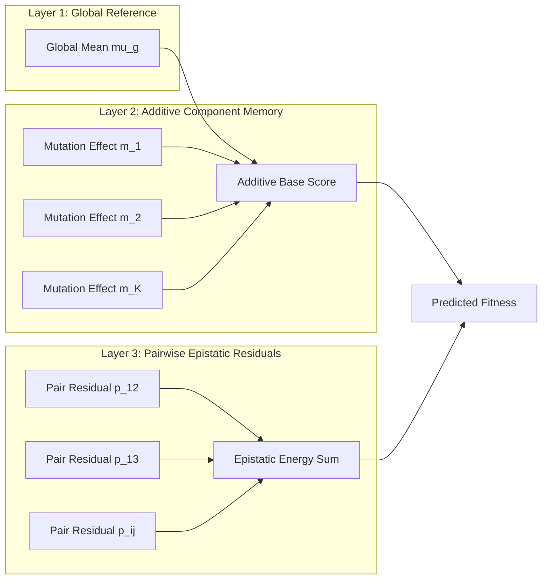

# Mathematical Architecture and Algorithmic Foundations

## 1. Problem Formulation

Let a protein variant $x$ be defined as a set of $K$ discrete amino-acid substitutions relative to a designated wild-type reference sequence:
$$x = \{m_1, m_2, \dots, m_K\}$$
where each element $m_k = (\text{wt\_aa}, \text{pos}_k, \text{mut\_aa})$ denotes a single-point substitution at residue position $\text{pos}_k$.

Given a training set of observed combinatorial variants $\mathcal{D}_{\text{visible}} = \{(x_i, y_i)\}_{i=1}^N$, where $y_i \in \mathbb{R}$ represents experimental fitness, the objective is to predict the fitness $\hat{y}(x)$ of unseen combinatorial variants $x \in \mathcal{X}_{\text{hidden}}$.

---

## 2. Layered Architectural Decomposition

### 2.1 Layer 1: Global Baseline
The visible sample mean $\mu_g$ is computed directly from training observations:
$$\mu_g = \frac{1}{|\mathcal{D}_{\text{visible}}|} \sum_{(x_i, y_i) \in \mathcal{D}_{\text{visible}}} y_i$$

### 2.2 Layer 2: Structured Component Memory with Empirical Bayesian Shrinkage
For each single substitution $m$, let $\mathcal{S}_m = \{(x_i, y_i) \in \mathcal{D}_{\text{visible}} \mid m \in x_i\}$ denote the subset containing $m$, with support $n_m = |\mathcal{S}_m|$.

The raw observed mean for substitution $m$ is:
$$\bar{y}_m = \frac{1}{n_m} \sum_{(x_i, y_i) \in \mathcal{S}_m} y_i$$

Under a Gaussian prior centered at the global mean, the shrinkage-adjusted component effect $C(m)$ is:
$$C(m) = (\bar{y}_m - \mu_g) \cdot \left( \frac{n_m}{n_m + \lambda_{\text{main}}} \right)$$
where $\lambda_{\text{main}} > 0$ serves as the empirical regularization prior (default $\lambda_{\text{main}} = 1.0$).

The additive base score for any combination $x$ is:
$$\text{Base}(x) = \mu_g + \sum_{m \in x} C(m)$$

---

### 2.3 Layer 3: Pairwise Epistatic Residuals and Energy Summation
Linear models fail to capture non-additive epistatic interactions. NABU computes first-order additive residuals for all visible variants:
$$r_i = y_i - \text{Base}(x_i)$$

For each residue pair $p = (m_j, m_k) \in \binom{x}{2}$, let $\mathcal{S}_p = \{(x_i, y_i) \in \mathcal{D}_{\text{visible}} \mid \{m_j, m_k\} \subseteq x_i\}$ with support $n_p = |\mathcal{S}_p|$.

The mean residual interaction is:
$$\bar{r}_p = \frac{1}{n_p} \sum_{i \in \mathcal{S}_p} r_i$$

Applying pairwise empirical Bayesian shrinkage yields:
$$R(p) = \bar{r}_p \cdot \left( \frac{n_p}{n_p + \lambda_{\text{pair}}} \right), \quad w_p = \frac{n_p}{n_p + \lambda_{\text{pair}}}$$

The total predicted fitness is calculated via epistatic energy summation:
$$\hat{y}_{\text{NABU}}(x) = \text{Base}(x) + \sum_{p \in \binom{x}{2}, \, p \in \mathcal{P}_{\text{obs}}} R(p) \cdot w_p$$

---

## 3. Computational and Asymptotic Complexity

| Metric | Deep Learning Models (ESM-2 / AlphaFold) | NABU Architecture | Ratio / Improvement |
| :--- | :---: | :---: | :---: |
| **Model Parameters** | $6.5 \times 10^8 - 3.0 \times 10^9$ | **0 parameters (Exact Hash Memory)** | $\infty$ |
| **Compute Hardware** | High-end GPU Clusters (A100 / H100) | **Standard x86 / ARM CPU** | $> 10^4\times$ lower compute |
| **Training Latency** | Hours to Days | **$< 0.5$ seconds** | $> 10^5\times$ faster |
| **Inference per Variant** | $50 - 200\text{ ms}$ | **$< 0.005\text{ ms}$** | $> 20,000\times$ faster |
| **Space Complexity** | $O(L^2)$ | **$O(N + |\mathcal{P}|)$** | Linear in observed pairs |
