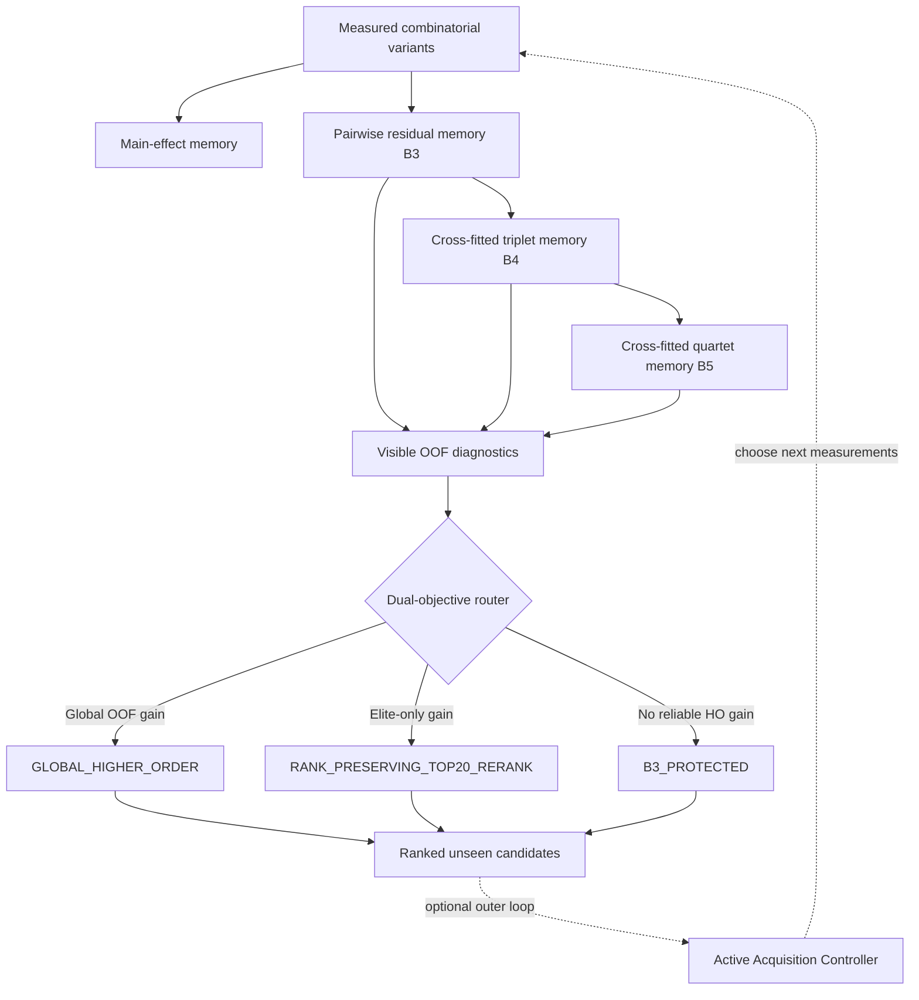

# NABU: Few-Shot Combinatorial Protein Design and Adaptive Epistatic Landscape Inference

[](PHASE1_FINAL_REPORT.md)
[](LICENSE)
[](ARCHITECTURE.md)
[](PHASE2_PLAN.md)

## Project status

**Phase 1 is formally closed.**

The frozen Phase-1 core is **NABU V8.3 Dual-Objective Router**, a non-parametric combinatorial fitness architecture that combines:

- additive main-effect memory,
- pairwise epistatic residual memory,
- cross-fitted triplet and quartet residual memory,
- visible-data OOF routing between global higher-order scoring, elite-only reranking, and protected pairwise scoring.

An optional **Active Acquisition controller** was developed above the frozen core to choose which variants should be measured next. It produced strong sample-efficiency results, but its behavior is non-monotonic across acquisition budgets; it is therefore preserved as an experimental controller rather than treated as a universally validated production component.

The final Phase-1 closure point is:

`freeze/nabu-phase1-final-cr9114-closed`  
Commit: `690494691c20edc3c9b7a6bba9a5156913173c58`

The frozen V8.3 core architecture remains:

`freeze/nabu-v8-3-dual-objective-router-validated`  
Commit: `c8afdcd7698231d95a39ef13a3fe22b6e3f507c5`

## What Phase 1 established

Phase 1 tested NABU across multiple published combinatorial protein fitness landscapes and progressively hardened the architecture from additive/pairwise modeling into a cross-fitted higher-order router.

The strongest conclusions are:

1. **Pairwise epistatic memory is a stable backbone.**
2. **Higher-order residual structure can add real hidden-set value when visible OOF evidence supports it.**
3. **Higher-order modeling is not universally beneficial, so adaptive routing is necessary.**
4. **The router can protect B3 exactly when higher-order signal is unsupported.**
5. **The same frozen V8.3 core generalized to fresh sealed 4/5-mutation validation on CR9114-H1.**
6. **Active measurement selection can substantially reduce required measurements on some budgets, but the current 50/50 controller is not monotonic and is not treated as fully validated.**

## Final Phase-1 validation: CR9114-H1

The final one-shot gate used a fresh CR9114-H1 combinatorial landscape with hidden 4/5-mutation variants.

Stage-A qualification before reveal:

- Passive 40% triplet memories: **546**
- Passive 40% quartet memories: **1,698**
- Active 20% triplet memories: **545**
- Active 20% quartet memories: **1,024**
- Hidden 4/5-mutant test variants: **1,673**
- Common hidden scoreable coverage: **100%**

Passive 40% core result:

- B3 Spearman: **0.9271**
- V8.3 Spearman: **0.9387**
- Strict gains on **4/5** primary metrics
- **Zero regression** on all five primary metrics
- Router mode: `GLOBAL_HIGHER_ORDER`

The V8.3 core therefore passed its final higher-order gate.

### Active Acquisition result

The preregistered final active target required **Active 20%** to reach the Passive 40% practical threshold.

Observed:

- **Active 10% passed** the Passive 40% threshold, corresponding to **4.0× measurement efficiency / 75% fewer measurements** under that threshold definition.
- **Active 20% failed** the preregistered threshold.
- Active 40% also did not monotonically improve over lower active budgets.

Because the preregistered final target was Active 20%, the formal final status remains:

`PHASE1_FINAL_GATE_CLOSED_WITH_LIMITATION`

This status is intentionally preserved. No post-reveal retuning is allowed on CR9114-H1.

## Architecture overview



See [ARCHITECTURE.md](ARCHITECTURE.md) for the mathematical definition.

## Phase-1 evidence highlights

| Landscape | Main purpose | Result |
| --- | --- | --- |
| PHOT | Cross-fitted higher-order development | Global higher-order gain |
| GB1 | Elite-vs-global routing | Elite-only reranking protected global rank |
| TrpB | Global higher-order routing | Global higher-order gain |
| PhoQ | Safety gate | B3 protected from harmful higher-order use |
| CreiLOV | Low-order to 4/5-mutant extrapolation | Strong pairwise extrapolation; router abstained from unsupported HO |
| eqFP611 | Fresh sealed higher-order test | PASS; strict gain on 4/5 endpoints |
| RhlA | Sample efficiency | 40% was the first passive budget meeting the frozen practical threshold |
| RhlA Active | Controller development | Retrospective Active 20% matched Passive 40% threshold (2× efficiency) |
| CR9114-H1 | Final fresh Phase-1 gate | Core PASS; Active 10% reached Passive 40%, Active 20% failed prereg target |

For exact metrics, see [BENCHMARKS.md](BENCHMARKS.md) and [PHASE1_FINAL_REPORT.md](PHASE1_FINAL_REPORT.md).

## What NABU is — and is not

NABU currently performs **combinatorial protein variant inference and design inside a known mutation vocabulary**.

It is not yet:

- a full-sequence de novo protein generator,
- a protein structure predictor,
- a replacement for AlphaFold, ProteinMPNN, RFdiffusion, or wet-lab validation,
- evidence of experimentally validated novel proteins outside published benchmark landscapes.

Phase 2 is intended to move from static ranking toward **closed-loop combinatorial design**, where NABU assembles and proposes novel mutation combinations, chooses the next experiments, updates its memory, and optimizes discovery under a fixed experimental budget.

See [PHASE2_PLAN.md](PHASE2_PLAN.md).

## Repository structure

```text
src/nabu_protein/                         Core package
experiments/v8_1_crossfit_higher_order_dev/
experiments/v8_2_objective_tournament/
experiments/v8_3_multilandscape_validation/
experiments/v8_3_creilov_sealed/
experiments/v8_3_eqfp611_sealed/
experiments/v8_3_rhla_sample_efficiency/
experiments/v8_3_rhla_active_acquisition/
experiments/v8_3_cr9114_final_phase1/

nabu_v8_3_*                               Frozen benchmark outputs
PHASE1_FINAL_REPORT.md                    Final Phase-1 scientific summary
PHASE2_PLAN.md                            Next-stage design plan
```

Historical experiment README and RUNBOOK files are retained unchanged as audit records of what was actually preregistered and run.

## Installation

```bash
pip install -e .
```

## Documentation

- [ARCHITECTURE.md](ARCHITECTURE.md) — frozen V8.3 core and optional acquisition layer
- [BENCHMARKS.md](BENCHMARKS.md) — consolidated benchmark results
- [EXPERIMENTS.md](EXPERIMENTS.md) — experiment lineage
- [NABU_V8_3_CANONICAL.md](NABU_V8_3_CANONICAL.md) — canonical Phase-1 core definition
- [PHASE1_FINAL_REPORT.md](PHASE1_FINAL_REPORT.md) — closure report
- [PHASE2_PLAN.md](PHASE2_PLAN.md) — Phase-2 plan
- [PATENT_NOTICE.md](PATENT_NOTICE.md) — legal notice
