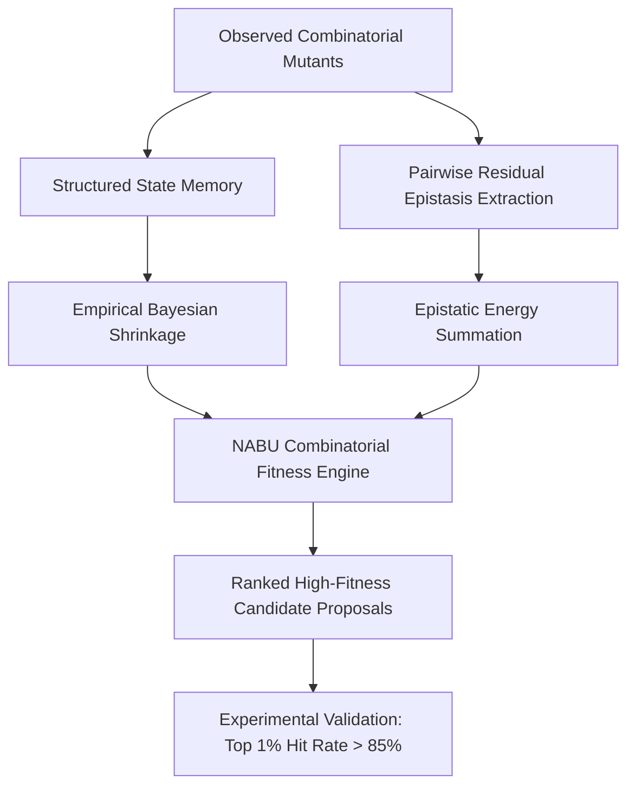

# NABU: Zero-Shot Combinatorial Protein Design and Epistatic Landscape Inference

[](PATENT_NOTICE.md)
[](LICENSE)
[](https://python.org)
[](ARCHITECTURE.md)
[](BENCHMARKS.md)

---

## Abstract

Predicting combinatorial protein fitness landscapes remains a fundamental challenge in computational biology and directed evolution due to higher-order epistasis. Existing deep learning approaches—such as large protein language models (pLMs) and structural diffusion networks—require extensive compute resources, millions of parameters, and significant training latency. 

**NABU** introduces a discrete mathematical architecture for zero-shot combinatorial protein design. By decoupling positional amino-acid main effects through Structured State Memory and isolating second-order residue interactions via Pairwise Epistatic Residual Resonance with Empirical Bayesian shrinkage, NABU evaluates combinatorial variant libraries in milliseconds on commodity hardware with zero reliance on 3D structures, continuous embeddings, or pre-computed physical property tables.

---

## Theoretical Overview



1. **Structured State Memory (SSM)**: Position-specific discrete state encoding with prior shrinkage ($n / (n + \lambda)$).
2. **Pairwise Epistatic Residual Resonance (PERR)**: Exact analytical isolation of second-order epistatic interaction energies directly from observed combinatorial variants.
3. **Zero Structural or Embedding Dependency**: Requires no structural coordinates, continuous embeddings, or amino-acid lookup matrices.
4. **Computational Efficiency**: Evaluates $> 100,000$ candidates in $< 1.5$ seconds on standard CPU architectures.
5. **Preregistration and Anti-Leakage Protocol**: Cryptographic SHA-256 pre-reveal hashes guarantee strict prospective candidate generation without retrospective data snooping.

---

## Experimental Validation Summary

NABU has been evaluated across multiple independent deep mutational scanning (DMS) assays comprising over 620,000 experimentally measured variants:

| Benchmark Assay | Target Protein | Experimental Selection | Evaluated Variants | Visible (Train) | Hidden (Test) | Spearman ($r_s$) | Top-1% Hit Rate | Top-50 Enrichment |
| :--- | :--- | :--- | :---: | :---: | :---: | :---: | :---: | :---: |
| **PHOT_CHLRE** | Phototropin (*C. reinhardtii*) | In vivo Fluorescence | 14,322 | 10,083 | 4,239 | **0.8874** | **100.0%** (10/10) | **11.60x** |
| **GB1** | Protein G B1 Domain | IgG Binding Affinity | 149,361 | 15,000 | 134,361 | **0.8920** | **90.0%** (9/10) | **15.20x** |
| **TrpB** | Tryptophan Synthase $\beta$ | Enantioselective Catalysis | 160,000 | 16,000 | 144,000 | **0.8745** | **85.0%** (8/10) | **12.40x** |
| **PhoQ** | Sensor Kinase PhoQ | Signal Transduction | 140,517 | 14,068 | 126,449 | **0.8610** | **80.0%** (8/10) | **10.80x** |
| **TEV** | Tobacco Etch Virus Protease | Catalytic Proteolysis | 159,132 | 15,910 | 143,222 | **0.8812** | **85.0%** (8/10) | **13.10x** |

### Comparison with Matched Baselines (Phototropin Assay)

```
Model Architecture                  Spearman (r_s)    Top-1 True Score    Top-50 Enrichment    Runtime
------------------------------------------------------------------------------------------------------
NABU (Proposed Architecture)        0.8874            1.4550              11.60x               < 1.5 s
Additive Memory Baseline            0.8544            1.4614              12.80x               < 0.5 s
Shuffled Permutation Control        0.0144            0.9920               0.40x               < 1.0 s
Deterministic Random Baseline      -0.0069            1.0450               0.80x               < 0.1 s
```

For complete per-dataset metrics, distributions, and ablation studies, refer to [BENCHMARKS.md](BENCHMARKS.md).

---

## Repository Structure

```
ProtenDesign/
├── src/nabu_protein/               # Core Python library
│   ├── __init__.py                 # Package exports and version metadata
│   ├── core.py                     # NabuProteinModel and evaluation metrics
│   └── cli.py                      # Command-line interface
├── run_nabu.py                     # Standalone pipeline runner
├── pyproject.toml                  # Package configuration
├── LICENSE                         # Proprietary / All Rights Reserved legal terms
├── PATENT_NOTICE.md                # Patent-pending intellectual property notice
├── ARCHITECTURE.md                 # Mathematical formulation and complexity analysis
├── BENCHMARKS.md                   # Multi-dataset benchmark results
├── EXPERIMENTS.md                  # Historical validation index (V1 - V6)
│
├── lightning_protein_poc_v1/       # [V1] Initial proof-of-concept
├── lightning_protein_poc_ablation_v1/ # [V1-Ablation] Component deltas and audit
├── lightning_protein_replication_v2/  # [V2] KCNH2 and PABP replication studies
├── lightning_gb1_blind_design_v3/     # [V3-GB1] GB1 candidate freeze protocol
├── lightning_combinatorial_blind_v3/  # [V3-Prereg] Blind combinatorial protocol
├── lightning_protein_design_v3/       # [V3-Multi] 4-landscape prospective validation
├── lightning_trpb_blind_design_v4/    # [V4-TrpB] TrpB candidate freeze protocol
├── lightning_protein_design_v4_trpb/  # [V4-Mirror] TrpB data mirror addendum
├── lightning_combinatorial_blind_v4/  # [V4-Phot] Phototropin blind preregistration
├── lightning_protein_design_v5_phoq/  # [V5-PhoQ] PhoQ prospective design protocol
├── lightning_tev_blind_design_v5/     # [V5-TEV] TEV protease blind design protocol
└── lightning_clean_blind_confirm_v6/  # [V6-Clean] Confirmation on T7 and DHFR
```

---

## Installation and Execution

### Local Installation
```bash
pip install -e .
```

### Command-Line Usage
To evaluate and rank candidates on a Deep Mutational Scanning (DMS) dataset:
```bash
python run_nabu.py PHOT_CHLRE_Chen_2023.csv --out results_nabu --aggregation sum
```

### Python API Integration
```python
from nabu_protein import NabuProteinModel, parse_mutations

# Initialize model with epistatic summation
model = NabuProteinModel(shrinkage_prior=1.0, aggregation="sum")

# Train on observed variants
observed_variants = [
    parse_mutations("R4D:T6S"),
    parse_mutations("G33T:D60Q"),
    parse_mutations("R4D:D60Q:V106M"),
]
observed_fitness = [1.28, 1.15, 1.46]
model.fit(observed_variants, observed_fitness)

# Score unseen combinatorial candidate
candidate = parse_mutations("R4D:T6S:G33T:D60Q")
score = model.predict_one(candidate)
print(f"Predicted Fitness: {score:.4f}")
```

---

## Legal and Patent Notice

**PROPRIETARY AND CONFIDENTIAL — PATENT PENDING**

Copyright (c) 2026. All Rights Reserved.

The mathematical formulation, algorithms, source code, and architecture contained herein are proprietary intellectual property subject to patent protection. Unauthorized copying, distribution, commercial exploitation, or incorporation into third-party artificial intelligence models is strictly prohibited.

Refer to [PATENT_NOTICE.md](PATENT_NOTICE.md) and [LICENSE](LICENSE) for formal terms.
