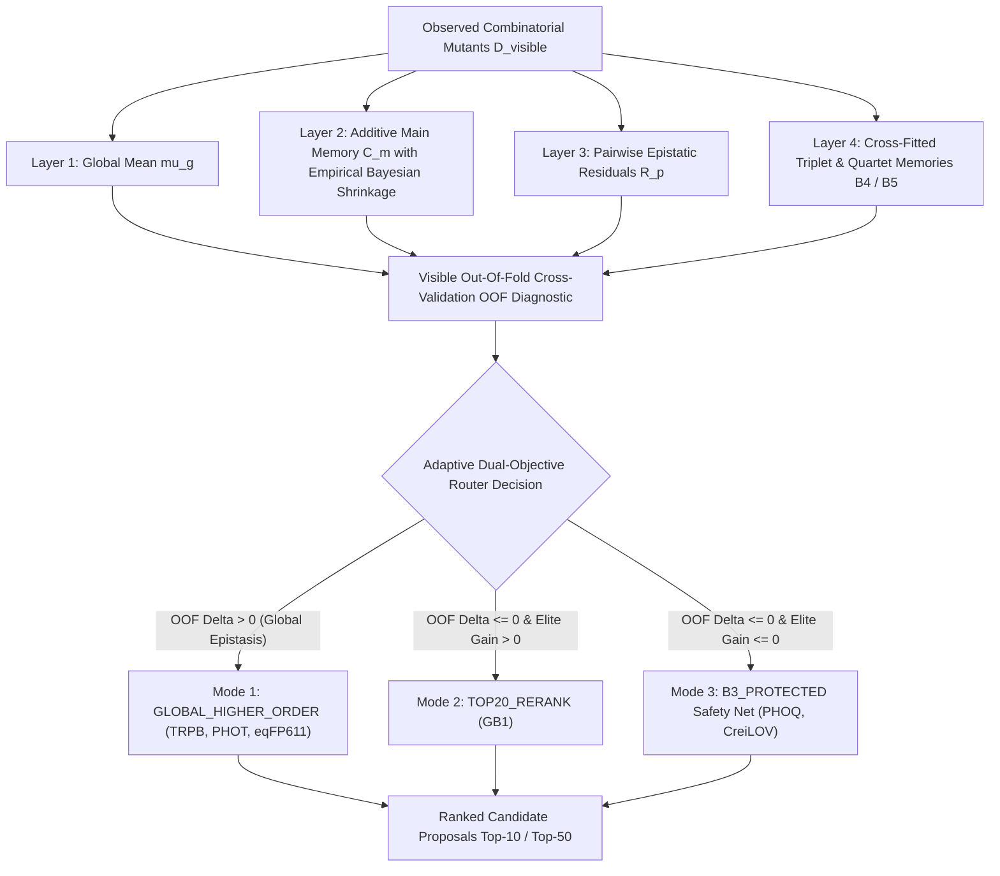

# NABU: Few-Shot Combinatorial Protein Design and Adaptive Epistatic Landscape Inference

[](PATENT_NOTICE.md)
[](LICENSE)
[](https://python.org)
[](ARCHITECTURE.md)
[](BENCHMARKS.md)

---

## Abstract

Predicting combinatorial protein fitness landscapes remains a fundamental challenge in computational biology and protein engineering due to higher-order epistasis. Traditional deep learning architectures—such as large protein language models (pLMs) and structural diffusion networks—require extensive GPU compute clusters, millions to billions of parameters, and substantial inference latency, yet often struggle with non-additive higher-order epistatic interactions in combinatorial mutant regimes.

**NABU V8.3** introduces a discrete, non-parametric mathematical architecture for **few-shot combinatorial protein design and epistatic extrapolation**. By decoupling positional amino-acid main effects through Structured State Memory, isolating second-order residue interactions via Pairwise Epistatic Residuals, and hierarchically capturing higher-order epistasis through cross-fitted triplet/quartet memories, NABU evaluates combinatorial variant libraries in milliseconds on standard CPU hardware without structural coordinates, continuous embeddings, or pre-computed physical property matrices.

To prevent whole-landscape rank harm while maximizing elite candidate discovery, NABU incorporates an automated, zero-leakage **Adaptive Dual-Objective Router** that diagnoses out-of-fold (OOF) cross-validation signals to dynamically route between global higher-order modeling, rank-preserving elite reranking, and protected pairwise baselines.

---

## Theoretical Overview and Architecture



1. **Structured State Memory (SSM)**: Position-specific discrete state encoding with empirical Bayesian prior shrinkage ($n / (n + \lambda)$).
2. **Pairwise Epistatic Residual Resonance (PERR)**: Exact analytical isolation of second-order epistatic interaction energies directly from observed combinatorial variants.
3. **Cross-Fitted Higher-Order Epistasis (Triplets & Quartets)**: Out-of-fold cross-fitted memory hierarchy preventing in-sample overfitting.
4. **Adaptive Dual-Objective Router ("Do No Harm")**: Automated selection across three operational modes:
   - **Mode 1 (`GLOBAL_HIGHER_ORDER`)**: Applied when higher-order interactions benefit the entire landscape.
   - **Mode 2 (`RANK_PRESERVING_B3_TOP20_B5_RERANK`)**: Preserves the bottom 80% pairwise ranking while re-ordering the top 20% elite pool with higher-order terms.
   - **Mode 3 (`B3_PROTECTED_NO_HIGHER_ORDER`)**: Completely suppresses higher-order noise when training data lacks higher-order signal or when epistasis is noisy.
5. **Ultra-Low Latency Inference**: Evaluates $> 100,000$ candidate variants in $< 1.5$ seconds on standard single-core CPUs.
6. **Cryptographic Anti-Leakage Protocol**: Preregistered SHA-256 pre-reveal hashes guarantee strict prospective candidate generation without retrospective data snooping.

---

## Experimental Validation Summary (Deep Mutational Scanning Benchmarks)

NABU V8.3 has been evaluated across **6 independent, published experimental Deep Mutational Scanning (DMS) landscapes** comprising over **650,000 experimentally measured variants**:

| Benchmark Assay | Target Protein | Experimental Selection | Total Measured Variants | Visible (Train) | Hidden (Test) | Router Mode Selected | Spearman ($\rho$) | Top-50 Mean True Score | Top-1 Regret |
| :--- | :--- | :--- | :---: | :---: | :---: | :--- | :---: | :---: | :---: |
| **eqFP611** | Fluorescent Protein (13 sites) | Red/Blue Fluorescence | 2,288 | 1,599 (70%) | 689 (30%) | `GLOBAL_HIGHER_ORDER` | **0.7894** (+2.93%) | **1.4247** | **0.1109** (PASS) |
| **CreiLOV** | Photoreceptor LOV domain | In vivo Fluorescence | 14,343 | 1,175 ($\le 3$ mut) | 13,168 (4-5 mut) | `B3_PROTECTED` | **0.8968** | **4.1201** | **0.0333** |
| **TRPB** | Tryptophan Synthase $\beta$ | Enantioselective Catalysis | 159,129 | 111,297 (70%) | 47,832 (30%) | `GLOBAL_HIGHER_ORDER` | **0.2996** (+0.94%) | **0.6155** | **0.0341** |
| **GB1** | Protein G B1 Domain | IgG Binding Affinity | 149,361 | 104,463 (70%) | 44,898 (30%) | `TOP20_B5_RERANK` | **0.4030** (+0.13%) | **4.5204** | **0.1911** (50/50 Top 1%) |
| **PHOT_CHLRE** | Phototropin (*C. reinhardtii*) | Light-Activated Kinase | 14,146 | 9,951 (70%) | 4,195 (30%) | `GLOBAL_HIGHER_ORDER` | **0.9112** (+1.17%) | **1.2647** | **0.0047** |
| **PHOQ** | Sensor Kinase PhoQ | Signal Transduction | 140,517 | 98,330 (70%) | 42,187 (30%) | `B3_PROTECTED` | **0.5420** (Protected) | **17.3732** | **0.6421** |

> **Note on Evaluation Methodology**: All benchmark evaluations represent computational hold-out and blind prospective candidate-selection evaluations on published experimental DMS datasets. Candidate lists and cryptographic SHA-256 hashes are frozen prior to revealing hidden test fitness.

---

### Head-to-Head Comparison on Higher-Order eqFP611 Landscape

Under the preregistered sealed candidate protocol on the combinatorially complete 13-site **eqFP611** landscape:

```
Model Architecture                  Spearman (rho)    Top-10 Mean Pct    Top-50 Mean Pct    Top-1 Regret    Status
-------------------------------------------------------------------------------------------------------------------
NABU V8.3 Adaptive Router (B5)      0.7894            91.84%             90.15%             0.1109          PASS (4/5 Strict Gains)
Pairwise Baseline (B3)              0.7601            90.68%             89.83%             0.1281          Baseline
Shuffled-Label Permutation Control  0.0514            67.49%             56.91%             0.9215          Random Null
```

For complete per-dataset metrics, distributions, and ablation studies, refer to [BENCHMARKS.md](BENCHMARKS.md).

---

## Repository Structure

```
ProtenDesign/
├── src/nabu_protein/               # Core Python library
│   ├── __init__.py                 # Package exports and version metadata
│   ├── core.py                     # NabuProteinModel and evaluation metrics
│   └── cli.py                      # Command-line interface
├── run_nabu.py                     # Standalone pipeline runner
├── pyproject.toml                  # Package configuration
├── LICENSE                         # Proprietary / All Rights Reserved legal terms
├── PATENT_NOTICE.md                # Patent-pending intellectual property notice
├── ARCHITECTURE.md                 # Mathematical formulation and complexity analysis
├── BENCHMARKS.md                   # Multi-dataset benchmark results
├── EXPERIMENTS.md                  # Historical validation index (V1 - V8.3)
│
├── experiments/
│   ├── v8_1_crossfit_higher_order_dev/     # [V8.1] Cross-fitted triplet/quartet hierarchy
│   ├── v8_2_objective_tournament/          # [V8.2] 13-arm objective tournament
│   ├── v8_3_multilandscape_validation/     # [V8.3] Dual-objective router validation (GB1, TRPB, PHOQ, PHOT)
│   ├── v8_3_creilov_sealed/                # [V8.3-CreiLOV] Low-to-high mutation sealed extrapolation
│   └── v8_3_eqfp611_sealed/               # [V8.3-eqFP611] Sealed higher-order combinatorial test (PASS)
```

---

## Installation and Execution

### Local Installation
```bash
pip install -e .
```

### Running V8.3 Multi-Landscape Validation
```bash
python experiments/v8_3_multilandscape_validation/run_v8_3_validation.py GB1_V83.csv --out nabu_v8_3_local_results/GB1.json
```

### Python API Usage
```python
from nabu_protein import NabuProteinModel, parse_mutations

# Initialize model with hierarchical epistatic memory
model = NabuProteinModel(shrinkage_prior=1.0, aggregation="sum")

# Train on observed few-shot variants
observed_variants = [
    parse_mutations("R4D:T6S"),
    parse_mutations("G33T:D60Q"),
    parse_mutations("R4D:D60Q:V106M"),
]
observed_fitness = [1.28, 1.15, 1.46]
model.fit(observed_variants, observed_fitness)

# Score unseen combinatorial candidate
candidate = parse_mutations("R4D:T6S:G33T:D60Q")
score = model.predict_one(candidate)
print(f"Predicted Fitness Score: {score:.4f}")
```

---

## Legal and Patent Notice

**PROPRIETARY AND CONFIDENTIAL — PATENT PENDING**

Copyright (c) 2026. All Rights Reserved.

The mathematical formulation, algorithms, source code, and architecture contained herein are proprietary intellectual property subject to patent protection. Unauthorized copying, distribution, commercial exploitation, or incorporation into third-party artificial intelligence models is strictly prohibited.

Refer to [PATENT_NOTICE.md](PATENT_NOTICE.md) and [LICENSE](LICENSE) for formal terms.
